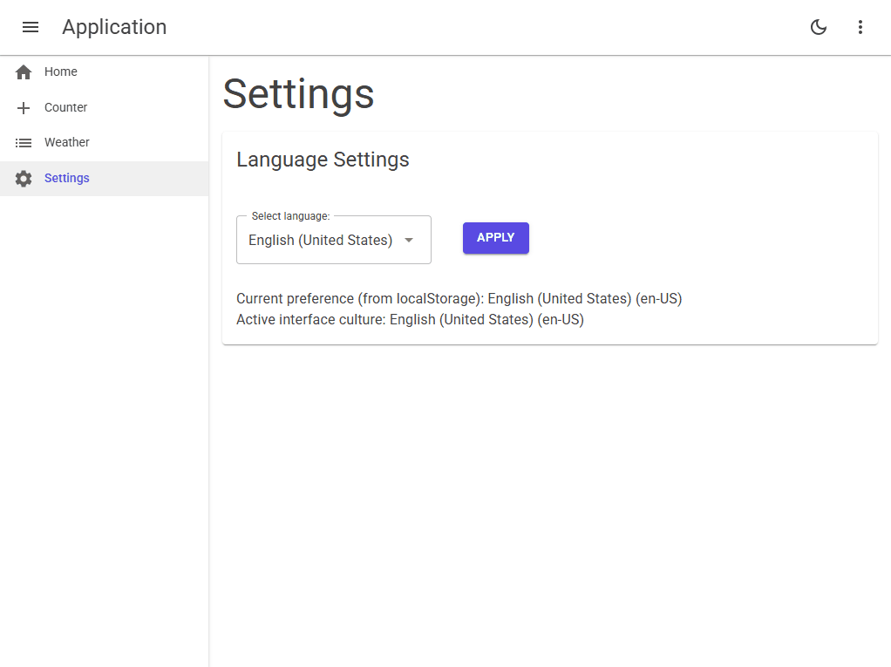

# 🌐 MudBlazor Multilingual Web Application



## 🚀 Overview

MudBlazorWebApp_Multilingual is a modern, professional web application built with Blazor Server and MudBlazor UI components. The project demonstrates best practices for implementing multilingual support, dynamic culture switching, and a clean, responsive user interface.

## ✨ Features

- 🌍 **Multilingual Support**  
  Seamlessly switch between multiple languages (English, Dutch, Polish) at runtime.

- 🎨 **Modern UI with MudBlazor**  
  Utilizes MudBlazor for a beautiful, material design-inspired interface.

- ⚙️ **User Language Preferences**  
  Remembers user language selection using localStorage for a personalized experience.

- 🛠️ **Dynamic Culture Switching**  
  Instantly updates the UI and content based on the selected language without page reloads.

- 🔒 **Persistent Settings**  
  Language preferences are stored and automatically applied on future visits.

- 📱 **Responsive Design**  
  Fully responsive layout for desktops, tablets, and mobile devices.

## 🖥️ Application Preview


> The above animation demonstrates the language selection and dynamic UI updates in real time.

## 📂 Project Structure

- `Components/` – Razor components for layout and pages
- `Resources/` – Localization resource files
- `Service/` – Culture settings and language management services
- `wwwroot/` – Static assets and JavaScript for culture switching

## ⚡ Quick Start

1. Clone the repository:
   ```powershell
   git clone <repo-url>
   ```
2. Navigate to the project directory:
   ```powershell
   cd MudBlazorWebApp_Multilingual
   ```
3. Run the application:
   ```powershell
   dotnet run
   ```

## 📖 Documentation

For detailed setup and customization instructions, see [`Doc/Multilingual.md`](MudBlazorWebApp_Multilingual/Doc/Multilingual.md).

---